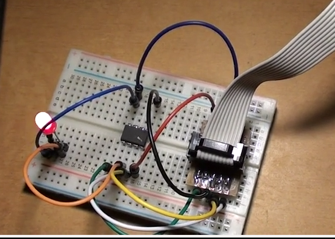

# The smallest blink code
```sh
Really tiny 
blink (26 bytes) and then
blink2 (24 bytes) and then
blink3 (22 bytes) and then
blink4 (20 bytes) and then
blink5 (18 bytes) and then
blink6 (16 bytes) eah, the most tricky one, and.. then
blink7 (14 bytes) am sorry then (;
blink8 (10 bytes) not funny..
@tiny attiny13.

avr-gcc -nostartfiles -nodefaultlibs -flto -no-pie -fno-stack-protector -fno-pic -Wall -Os -mmcu=attiny13 -o blink blink6.S
avr-objcopy -O ihex blink blink.hex
avr-size blink.hex
  text	   data	    bss	    dec	    hex	filename
      0	     10	      0	     10	      a	blink.hex
```


```sh
0000000 <.sec1>:
   0:	b9 9a       	sbi	0x17, 1	; 23
   2:	31 97       	sbiw	r30, 0x01	; 1
   4:	f7 ff       	sbrs	r31, 7
   6:	e8 bb       	out	0x18, r30	; 24
   8:	fc cf       	rjmp	.-8      	;  0x2
```
